# LPIC-1 Document
## Chapter 1 : Khám phá Linux Command-Line Tools
---
### Các Linux Shell thường gặp
- **Bash** : (GNU Bourne Again shell) release năm 1989, thường được sử dụng làm default shell cho Linux user account.
- **Dash** : (Debian Almquist shell) release năm 2002, loại shell này không cho phép chỉnh sửa command-line và command history, tuy nhiên nó thực thi script nhanh hơn
- **KornShell** : release năm 1983 nhưng vẫn là phần mềm độc quyền đến năm 2002, là 1 shell tương thích với Bourne Shell nhưng cung cấp tính năng lập trình nâng cao hơn
- **tcsh** : (TENEX C Shell) release năm 1981, là bản nâng cấp của C Shell. Tích hợp thêm tính năng điền tự động, ngoài ra còn kết hợp thêm các thành phần của ngôn ngữ lập trình C vào shell script
- **Z shell** : release năm 1990, tích hợp các tính năng của Bash, tcsh, KornShell cung cấp các tính năng lập trình nâng cao, shared history file, theme promt...
#### Các lệnh được dùng để kiểm tra shell
- Lệnh `readlink` hiển thị shell mà `/bin/sh` trỏ tới
```
$ readlink /bin/sh
bash
```
- Lệnh `echo` sử dụng để hiển thị dữ liệu
```
$ echo $SHELL   # Hiển thị loại shell đang dùng
/bin/bash
$ echo $BASH_VERSION # Hiển thị bash version
4.2.46(2)-release
```
- Lệnh `uname` sử dụng để hiển thị thông tin về Linux Kernel
```
$ uname # Hiển thị tên của Kernel
Linux
$
$ uname -r  # Hiển thị version của Kernel
4.15.0-46-generic
$
$ uname -a # Hiển thị toàn bộ thông tin của lệnh (Tên, version, loại processor, OS)
Linux Ubuntu1804 4.15.0-46-generic #49-Ubuntu SMP Wed Feb 6
09:33:07 UTC 2019 x86_64 x86_64 x86_64 GNU/Linux
```
### Sử dụng ký tự đặc biệt trong Shell
Trong Shell có các ký tự đặc biệt sau : 
```
* ? [ ] ' " \ $ ; & ( ) | ^ < >
```
Để có thể sử dụng chúng như 1 ký tự thông thường, ta có thể thêm ký tự `\` và `" "`
```
$ echo It cost \$1.00
It cost $1.00
$ echo Is "Schrodinger's" cat alive or "dead?"
Is Schrodinger's cat alive or dead?
```
### Điều hướng trong Directory Structure
File trong HĐH Linux được lưu trữ trong 1 cấu trúc thư mục được gọi là ***virtual directory***. Nó lưu trữ toàn bộ file trên storage của máy vào 1 cấu trúc thư mục đơn (Single Directory Structure) được gọi là ***root directory***.

Khi login vào Linux system, *current working directory* sẽ là thư mục `*home*` của user.

Để di chuyển giữa các thư mục ta sử dụng lệnh `cd`, ngoài ra sử dụng lệnh `pwd` để xem current working directory.

Khi sử dụng `cd` có thể sử dụng ***Absolute directory references*** hoặc ***Relative directory references***
- Absolute directory references (Đường dẫn tuyệt đối) : Bắt đầu bằng `/` và tiếp theo là đường dẫn đầy đủ để đi tới vị trí của nó.
- Relative directory references (Đường dẫn tương đối) : Không bắt đầu bằng `/` mà bắt đầu từ current working directory.

```
$ pwd
/home/Christine
$
$ cd /etc
$ pwd
/etc
$ cd cups
$ pwd
/etc/cups
$
$ cd ..
$ pwd
/etc
```

### Tìm hiểu về Internal và External command

Các lệnh được tích hợp sẵn vào shell được gọi là ***Built-int*** command. Các lệnh khác được gọi là ***External*** command do nó không phải là 1 phần của shell.

Để kiểm tra xem 1 lệnh là built-in hay external hãy sử dụng lệnh `type`
```
$ type echo
echo is a shell builtin
$
$ type pwd
pwd is a shell builtin
$
$ type uname
uname is /usr/bin/uname
```

### Sử dụng Environment Variables

Environment Variables là 1 object chứa dữ liệu ảnh hưởng tới hành vi của process và application trong Linux Operating System. Các variable này là các cặp giá trị (key - value) để lưu trữ và chia sẻ cấu hình thiết lập, path và 1 số thông tin khác liên quan đến process và application.

Một số Environment Variables thường dùng :

| Tên  			| Mô tả 		|
| ------------- |-------------|
|PATH			|Danh sách các thư mục mà shell sẽ tìm khi sử dụng lệnh (vd: ls, vim).	|
|BASH_VERSION	|Phiên bản bash shell đang sử dụng	|
|HOME			|Thư mục home của user hiện tại (vd: /home/dat).						|
|USER			|Tên user đang đăng nhập.	|
|SHELL			|Shell mặc định của user (vd: /bin/bash).	|
|PWD			|Thư mục hiện tại (Present Working Directory).	|
|LANG			|Ngôn ngữ hệ thống.	|
|EDITOR			|Trình soạn thảo mặc định (nano, vim).	|
|TERM			|Loại terminal (xterm, vt100).	|

Để hiển thị toàn bộ danh sách các environment variable đang active trên shell, sử dụng lệnh `set` :
```
$ set
[…]
BASH=/bin/bash
[…]
HISTFILE=/home/Christine/.bash_history
[…]
HISTSIZE=1000
HOME=/home/Christine
HOSTNAME=localhost.localdomain
[…]
PS1='$ '
PS2='> '
[…]
SHELL=/bin/bash
[…]
$
```

> Ngoài ra còn có thể sử dụng lệnh `env` và `printenv` để xem các variable

Khi nhập 1 command vào shell promt, shell sẽ tìm trong tất cả các directory được liệt kê trong PATH environment variable cho command đó.

```
$ echo $PATH
/usr/local/bin:/usr/bin:/usr/local/sbin:/usr/sbin:
/home/Christine/.local/bin:/home/Christine/bin
$
$ ls /home/Christine/Hello.sh
/home/Christine/Hello.sh
$
$ Hello.sh
bash: Hello.sh: command not found…
```

Để chạy command không nằm trong PATH directory location, ta phải nhập đủ đường dẫn tuyệt đối tham chiếu tới lệnh đó.

```
$ /home/Christine/Hello.sh
Hello World
$
```

Lệnh ***which*** rất hữu ích khi giúp tìm kiếm trong PATH Directory để tìm kiếm program (command). Nếu nó xác định được vị trí của progam, nó sẽ hiển thị đường dẫn tuyệt đối tham chiếu tới program đó.

```
$ which Hello.sh
/usr/bin/which: no Hello.sh in (/usr/local/bin:/usr/bin:
/usr/local/sbin:/usr/sbin:/home/Christine/.local/bin:/home/Christine/bin)
$
$ which echo
/usr/bin/echo
$
```

Ta có thể thay đổi Environment variable bằng cách nhập `variable name = new value`. Tuy nhiên cách này tồn tại nhược điểm như là variable sẽ không tồn tại khi sử dụng `subshell`.

> Để xác định xem có đang ở Subshell hãy không, hãy nhìn vào giá trị của SHLVL environment variable. `1` có nghĩ là ***không*** trong subshell, lớn hơn tức là đang trong subshell.

```
My new prompt: echo $SHLVL
1
My new prompt: bash
$
$ echo $PS1
$
$ echo $SHLVL
2
$ exit
exit
```

Để thay đổi giá trị của Environment variable đúng cách, sử dụng lệnh `export`.

```
My new prompt: export PS1="KeepPrompt: "
KeepPrompt:
KeepPrompt: bash
KeepPrompt:
KeepPrompt: echo $SHLVL
2
KeepPrompt:
KeepPrompt: PS1="$ "
$ export PS1
$
```

Nếu variable không có giá trị ban đầu (***blank***), ta có thể hoàn tác các thay đổi của variable về ban đầu bằng lệnh `unset`.

```
$ echo $EDITOR
$ export EDITOR=nano
$
$ echo $EDITOR
nano
$
$ unset EDITOR
$
$ echo $EDITOR
$
```

### Getting Help

Linux system có 1 utility cung cấp các chỉ dẫn, cú pháp cho các lệnh mà ta sử dụng, đó chính là `man page`.

Shell theo dõi tất cả các lệnh mà ta sử dụng gần đây và lưu trữ chúng trong history list của session hiện tại. Để xem history list đó, nhập lệnh `history`.

```
$ history
[…]
915 echo $EDITOR
916 export EDITOR=nano
917 echo $EDITOR
918 unset EDITOR
919 echo $EDITOR
920 man -k passwd
[…]
$
```

Để thực hiện lại 1 lệnh nằm trong history list, ta sử dụng *! + số thứ tự* được liệt kê ở đầu của lệnh đó.

```
$ !920
man -k passwd
[…]
passwd (1) - update user's authentication tokens
[…]
passwd (5) - password file
[…]
```

> Dùng `!!` để thực hiện lệnh gần đây nhất

History list được lưu giữa các login session trong file được chỉ định bởi ***$HISTFILE*** environment variable ( Thường là file `.bash_history` trong home directory ).

```
$ echo $HISTFILE
/home/Christine/.bash_history
$
```

> file history này sẽ không lưu các lệnh dùng ở session hiện tại.

Sử dụng các option :

* `-a` gán các lệnh dùng trong session hiện tại vào history file
* `-n` gán các lệnh mới từ history file mà chưa load vào session hiện tại
* `-r` ghi đè các lệnh trong session hiện tại bằng các lệnh lưu trong history file
* Để xoá hoàn toàn command-line history :
	* `-c` để xoá các lệnh dùng trong session hiện tại
	* `-w` để ghi session hiện tại vào history file
	
### Edit Text File 

Để làm việc với text file, công cụ phù hợp nhất sẽ là `vim`.

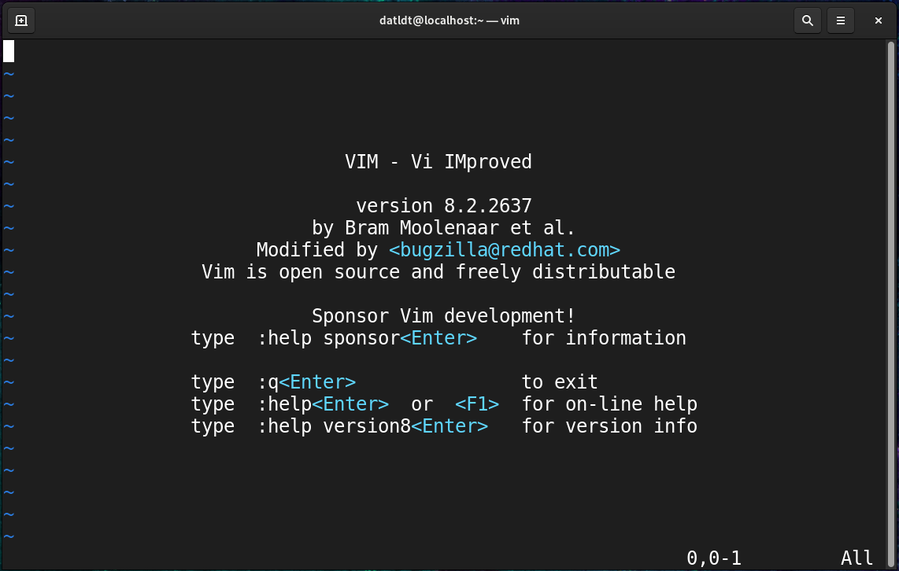

Vim xử lý dữ liệu của file trong memory buffer, buffer này sẽ hiển thị dữ liệu đó lên trên screen. Nếu ta tạo file với vim, nó sẽ tạo ra 1 buffer area mới cho file này.

#### Các Vim mode

* ***Command Mode (Normal mode)*** :  Mặc định khi mở file, chế độ này dùng để tương tác với các phím tắt của vim.
* ***Inset Mode (Edit mode)*** : Chế độ dùng để chỉnh sửa nội dụng của file. Xác định bằng `--Insert--` ở phía dưới của vim. Ấn `I` để vào Insert Mode và `Esc` để thoát.
* ***Ex Mode (Colon command)*** : Dùng để thao tác với các command. Được xác định bằng dấu `:`

#### Khám phá 1 số quy tắc edit cơ bản

Sau đây là 1 số key để sử dụng để di chuyển trong Command mode :

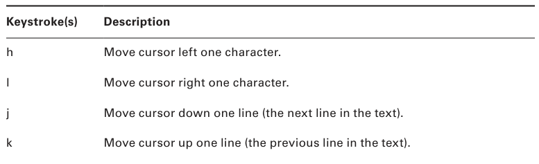
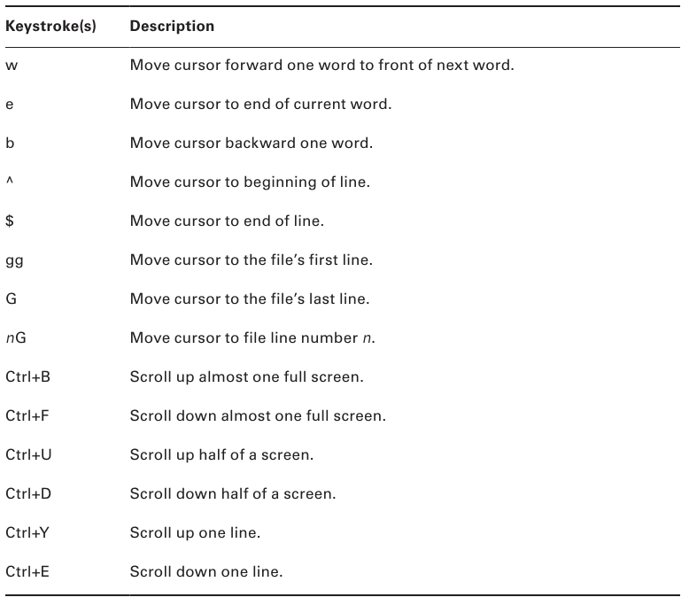

> Để tìm kiếm trong vim, gõ `?` để tìm kiếm tiến hoặc `/` để tìm kiếm lùi. Nếu giá trị đầu tiên không phải giá trị ta muốn tìm, nhấn `Enter` và nhấn `n` để tìm giá trị tiếp theo.

Sau đây là 1 số key để sử dụng để chỉnh sửa trong Command mode :

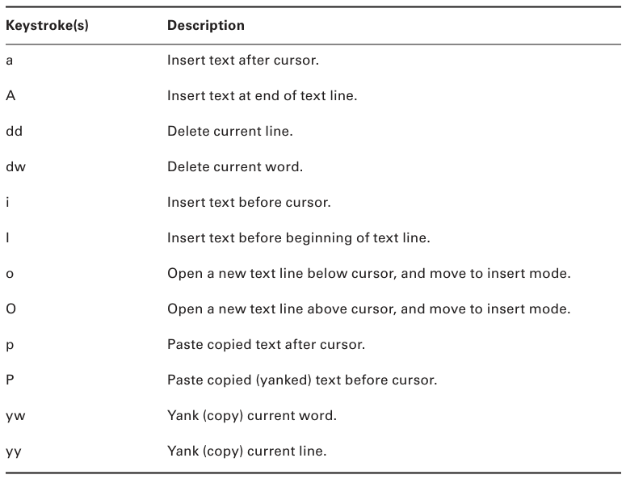

Sau đây là 1 số lệnh được sử dụng trong Ex mod command :

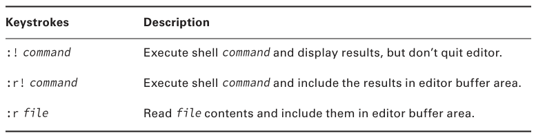

#### Lưu thay đổi

Có thể nhấn `ZZ` để lưu buffer và thoát session hiện tại. Ngào ra còn có 1 số phương pháp sau :

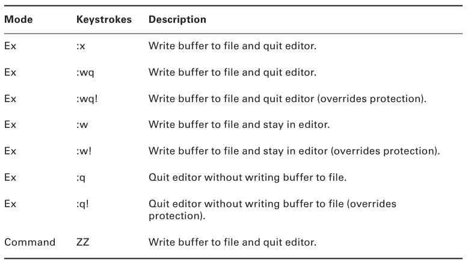

### Thao tác với Text File

#### Các lệnh kết hợp file

***concatenate command*** được sử dụng để xem toàn bộ nội dung của file text.
 
```
$ cat numbers.txt
42
2A
52
0010 1010
*
$
```
 
> Mặc dù mục đích chính của lệnh này là gán nội dung text file lại và hiển thị chúng, tuy nhiên nó thường được dùng để hiển thị 1 file text nhỏ.

```
$ cat numbers.txt random.txt
42
2A
52
0010 1010
*
42
Flat Land
Schrodinger's Cat
0010 1010
0000 0010
$
```

Các option thường dùng :
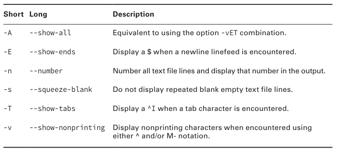

Nếu ta muốn đặt nội dung của 2 file bên cạnh nhau (side-by-side), có thể sử dụng ***paste*** command. Tuy nhiêu output sẽ không được đồng đều.

```
$ paste random.txt numbers.txt
42 42
Flat Land 2A
Schrodinger's Cat 52
0010 1010 0010 1010
0000 0010 *
```

#### Các lệnh biến đổi file

##### làm việc với od command

Lệnh ***od*** cho phép ta hiển thị nội dung của file dưới dạng *octal (Hệ 8 - Mặc định)*, *hexadecimal (Hệ 16)*, *decimal (Hệ 10)*, và *ASCII*.

```
$ cat fourtytwo.txt
42
fourty two
quarante deux
zweiundvierzig
forti to
$
$ od fourtytwo.txt
0000000 031064 063012 072557 072162 020171 073564 005157 072561
0000020 071141 067141 062564 062040 072545 005170 073572 064545
0000040 067165 073144 062551 075162 063551 063012 071157 064564
0000060 072040 005157
0000064
```

> Cột đầu tiên của output chính là index của từng dòng

##### Tách file với split

***split*** cho phép chia nhỏ 1 file lớn thành các file nhỏ hơn theo size, bytes, lines, v.v. File gốc sẽ ***không*** thay đổi, các file được tách ra sẽ tạo mới tuỳ theo option được sử dụng.

```
$ cat fourtytwo.txt
42
fourty two
quarante deux
zweiundvierzig
forti to
$
$ split -l 3 fourtytwo.txt split42
$
$ ls split42*
split42aa split42ab
$
$ cat split42aa
42
fourty two
quarante deux
$
$ cat split42ab
zweiundvierzig
forti to
$
```

#### Các lệnh format file

##### Sắp xếp với sort

Lệnh ***sort*** được sử dụng để sắp xếp nội dung của file. Nó không làm thay đổi nội dung của file gốc, chỉ output bị sắp xếp lại.

```
$ cat alphabet.txt
Alpha
Tango
Bravo
Echo
Foxtrot
$
$ sort alphabet.txt
Alpha
Bravo
Echo
Foxtrot
Tango
$
```

> Lưu ý rằng lệnh sort theo mặc định sẽ chỉ sắp xếp theo alphabet, không sắp xếp theo số thứ tự. Nếu muốn hãy sử dụng option `-n`.

```
$ sort counts.txt
105
37
42
54
8
$ sort -n counts.txt
8
37
42
54
105
$
```

##### Đánh số với nl

Lệnh ***nl*** rất hữu dụng khi giúp đánh số các dòng chứa dữ liệu của file text (Mặc định). Ngoài ra nó còn hỗ trợ Regular Expression để chỉ định các dòng được đánh số.

```
$ nl ContainsBlankLines.txt
1 Alpha
2 Tango

3 Bravo
4 Echo


5 Foxtrot
$
```

> Để đánh số dòng các blank line, sử dụng thêm option `-ba`.

```
$ nl -ba ContainsBlankLines.txt
1 Alpha
2 Tango
3
4 Bravo
5 Echo
6
7
8 Foxtrot
$
```

#### Các lệnh xem file

Với các file text ngắn, sử dụng `cat` là đủ. Tuy nhiên, khi xem 1 file có nội dung dài hơn thì lại không phù hợp.

##### Sử dụng more / less

Với `more`, ta có thể di chuyển qua text file bằng cách nhấn `Spacebar` ( 1 trang) hoặc `Enter` (1 dòng). Tuỳ nhiên nó không cho phép quay lại trang / dòng trước đó.

Còn `less` thì linh hoạt hơn. Nó cho phép di chuyển tiến lùi không bị giới hạn (`Esc + V`). Cả 2 lệnh này đều dùng `Q` để thoát.

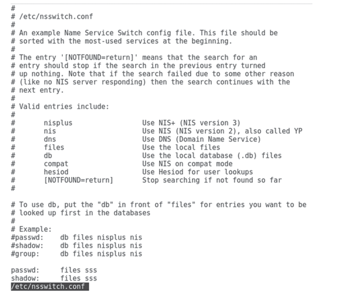

> Ngoài ra có thể tìm kiếm từ khoá bằng `/` - tìm theo chiều xuôi và `?` - tìm kiếm theo chiều ngược.

##### Xem file với head

***head*** command cho phép ta hiển thị 10 dòng đầu của text file (mặc định).

```
$ head /etc/passwd
root:x:0:0:root:/root:/bin/bash
bin:x:1:1:bin:/bin:/sbin/nologin
daemon:x:2:2:daemon:/sbin:/sbin/nologin
adm:x:3:4:adm:/var/adm:/sbin/nologin
lp:x:4:7:lp:/var/spool/lpd:/sbin/nologin
sync:x:5:0:sync:/sbin:/bin/sync
shutdown:x:6:0:shutdown:/sbin:/sbin/shutdown
halt:x:7:0:halt:/sbin:/sbin/halt
mail:x:8:12:mail:/var/spool/mail:/sbin/nologin
operator:x:11:0:operator:/root:/sbin/nologin
$
```

> Có thể dùng `-n` để chọn số dòng muốn hiển thị.

```
$ head -n 2 /etc/passwd
root:x:0:0:root:/root:/bin/bash
bin:x:1:1:bin:/bin:/sbin/nologin
$
```

##### Xem file với tail

Tương tự như `head`, ***tail*** command sẽ hiện thị 10 dòng cuối của text file.

> Khi dùng `-n`, nếu ta thêm `+` vào trước số dòng thì lệnh `tail` sẽ hiển thị bắt đầu từ dòng đó cho tới cuối file.

```
$ tail /etc/passwd
saslauth:x:992:76:Saslauthd user:/run/saslauthd:/sbin/nologin
pulse:x:171:171:PulseAudio System Daemon:/var/run/pulse:/sbin/nologin
gdm:x:42:42::/var/lib/gdm:/sbin/nologin
setroubleshoot:x:991:985::/var/lib/setroubleshoot:/sbin/nologin
rpcuser:x:29:29:RPC Service User:/var/lib/nfs:/sbin/nologin
nfsnobody:x:65534:65534:Anonymous NFS User:/var/lib/nfs:/sbin/nologin
sssd:x:990:984:User for sssd:/:/sbin/nologin
gnome-initial-setup:x:989:983::/run/gnome-initial-setup/:/sbin/nologin
tcpdump:x:72:72::/:/sbin/nologin
avahi:x:70:70:Avahi mDNS/DNS-SD Stack:/var/run/avahi-daemon:/sbin/nologin
$
$ tail -n 2 /etc/passwd
tcpdump:x:72:72::/:/sbin/nologin
avahi:x:70:70:Avahi mDNS/DNS-SD Stack:/var/run/avahi-daemon:/sbin/nologin
$
$ tail -n +42 /etc/passwd
gnome-initial-setup:x:989:983::/run/gnome-initial-setup/:/sbin/nologin
tcpdump:x:72:72::/:/sbin/nologin
avahi:x:70:70:Avahi mDNS/DNS-SD Stack:/var/run/avahi-daemon:/sbin/nologin
$
```

> tail rất hữu ích khi theo dõi log file. Chỉ cần sử dụng `-f` / `--follow` để theo dõi mỗi khi file có dữ liệu mới được thêm vào.

```
$ sudo tail -f /var/log/auth.log
[sudo] password for Christine:
Aug 27 10:15:14 Ubuntu1804 sshd[15662]: Accepted password […]
Aug 27 10:15:14 Ubuntu1804 sshd[15662]: pam_unix(sshd:sess[…]
Aug 27 10:15:14 Ubuntu1804 systemd-logind[588]: New sessio[…]
Aug 27 10:15:50 Ubuntu1804 sudo: Christine : TTY=pts/1 ; P[…]
Aug 27 10:15:50 Ubuntu1804 sudo: pam_unix(sudo:session): s[…]
Aug 27 10:16:21 Ubuntu1804 login[10703]: pam_unix(login:se[…]
Aug 27 10:16:21 Ubuntu1804 systemd-logind[588]: Removed se[…]
^C
$
```

#### Lệnh tóm tắt thông tin của File

##### Đếm file với wc

Khi sử dụng ***wc*** command mà không kèm các option, nó sẽ hiển thị ***số dòng***, ***số từ***, ***bytes*** của file đó.

```
$ wc random.txt
5 9 52 random.txt
$
```

1 số option thường dùng :

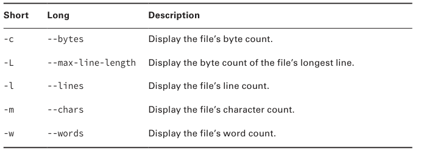

##### Phân tách dữ liệu trong file với cut

Lệnh ***cut*** là 1 lệnh hữu ích giúp sàng lọc dữ liệu trong file lớn, giúp tách dữ liệu thành các section để hiển thị.

1 số khái niệm để hiểu rỏ `cut` hơn :
	* Text file record : là 1 dòng trong file kết thúc bằng 1 newline linefeed (Ký tự xuống dòng) - ASCII character LF.
	* Text file record delimiter: là 1 hoặc nhiều ký tự tạo thành phân cách giữa các trường dữ liệu trong record. VD : như trong password file, `/etc/passwd` sử dụng dấu `:` để chia cách các trường dữ liệu trong record.

> Lệnh cut không làm ảnh hưởng tới file gốc.

1 số option thường dùng :

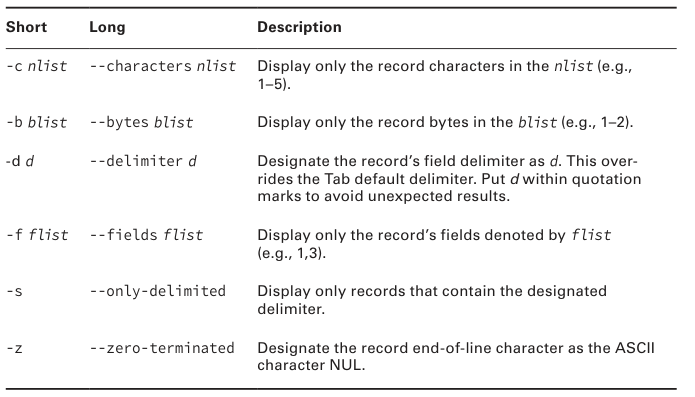

```
$ head -2 /etc/passwd
root:x:0:0:root:/root:/bin/bash
bin:x:1:1:bin:/bin:/sbin/nologin
$
$ cut -d ":" -f 1,7 /etc/passwd
root:/bin/bash
bin:/sbin/nologin
[…]
$
```	

##### Phát hiện lặp với uniq

Để tìm các dòng trùng lặp trong file, ta có thể sử dụng ***uniq*** command.

> `uniq` sẽ chỉ tìm thấy cái dòng dữ liệu trùng lặp nếu chúng nằm liền kề nhau.
>
>> Nếu không sử dụng option nào, nó sẽ loại bỏ các trùng lặp để hiển thị các dòng độc nhất (unique).

##### Kiếm tra tính toàn vẹn của file với Secure Hash Algorithms (SHA)

Thông thường SHA được dùng để mã hoá, tuy nhiên nó có thể được sử dụng để kiểm tra tính toàn vẹn của file sau khi copy hoặc di chuyển đến vị trí khác.

```
$ sha256sum fourtytwo.txt
0b2b6e2d8eab41e73baf0961ec707ef98978bcd8c7
74ba8d32d3784aed4d286b fourtytwo.txt
$
$ sha512sum fourtytwo.txt
ac72599025322643e0e56cff41bb6e22ca4fbb76b1d
7fac1b15a16085edad65ef55bbc733b8b68367723ced
3b080dbaedb7669197a51b3b6a31db814802e2f31 fourtytwo.txt
$
```

### Sử dụng Regular Expression

#### Sử dụng Grep

***grep*** là 1 lệnh được dùng để tìm kiếm và lọc dữ liệu hiệu quả kết hợp với việc sử dụng regular expression.

1 số option thường dùng với grep :
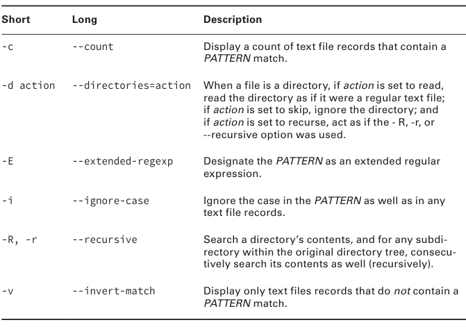

VD : Không sử dụng option, search từ `root` (*Pattern*) trong file `/etc/passwd`

```
$ grep root /etc/passwd
root:x:0:0:root:/root:/bin/bash
operator:x:11:0:operator:/root:/sbin/nologin
$
```

Ta cũng có thể dùng 1 danh sách các pattern được lưu trong 1 file bằng 1 biến thể khác của grep - `fgrep`.

```
$ cat accounts.txt
sshd
Christine
nfsnobody
$
$ fgrep -f accounts.txt /etc/passwd
sshd:x:74:74:Privilege-separated SSH:/var/empty/sshd:/sbin/nologin
Christine:x:1001:1001::/home/Christine:/bin/bash
nfsnobody:x:65534:65534:Anonymous NFS User:/var/lib/nfs:/sbin/nologin
$
$ grep -F -f accounts.txt /etc/passwd
sshd:x:74:74:Privilege-separated SSH:/var/empty/sshd:/sbin/nologin
Christine:x:1001:1001::/home/Christine:/bin/bash
nfsnobody:x:65534:65534:Anonymous NFS User:/var/lib/nfs:/sbin/nologin
$
```

> 2 lệnh trên có công dụng tương tự nhau.

#### Tìm hiểu về Regular Expression cơ bản

1 số Basic Regular Expression :
- `.*` : biểu diễn nhiều ký tự.
- `.` : biểu biễn 1 ký tự.
- `[a,e,i,o,u]` : biểu diễn các ký tự trong ngoặc
- `[A-z]` : biểu diễn chuỗi các ký tự trong ngoặc.
- `^` : tìm kiếm các chuỗi bắt đầu với các ký tự nhất định.
- `$` : tìm kiếm các chuỗi kết thúc với các ký tự nhất định.

> Các biểu thức sử dụng `[]` được gọi là **bracket expression**

```
$ grep daemon.*nologin /etc/passwd
daemon:x:2:2:daemon:/sbin:/sbin/nologin
[…]
daemon:/dev/null:/sbin/nologin
[…]
$
$ grep root /etc/passwd
root:x:0:0:root:/root:/bin/bash
operator:x:11:0:operator:/root:/sbin/nologin
$
$ grep ^root /etc/passwd
root:x:0:0:root:/root:/bin/bash
```

Khi dùng option `-v` cùng grep, nó sẽ cho ra 1 danh sách các record không chưa pattern đó.

```
$ grep -v nologin$ /etc/passwd
root:x:0:0:root:/root:/bin/bash
sync:x:5:0:sync:/sbin:/bin/sync
[…]
Christine:x:1001:1001::/home/Christine:/bin/bash
$
```

Trong bracket expression có 1 nhóm đặc biệt được gọi là character classes. Các biểu thức này được đặt tên và có thể coi là bracket expression shortcuts.

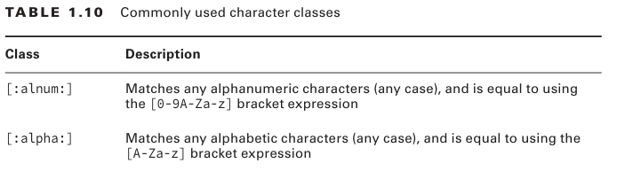

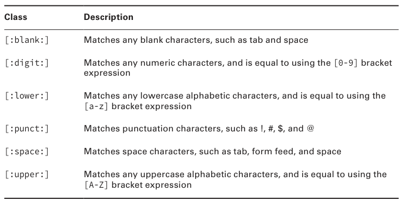

```
$ cat random.txt
42
Flat Land
Schrodinger's Cat
0010 1010
0000 0010
$
$ grep [[:digit:]] random.txt
42
0010 1010
0000 0010
$
```

